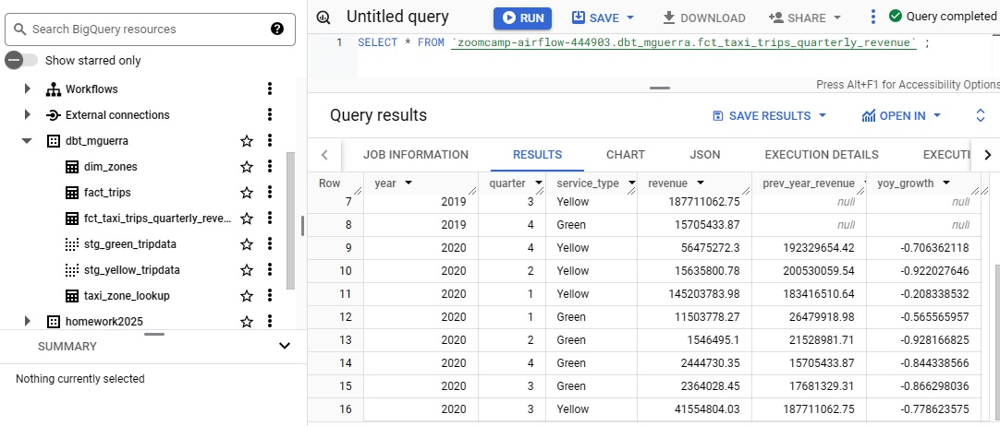

# Module 4 Homework

For this homework, you will need the following datasets:

- Green Taxi dataset (2019 and 2020): 7,778,101 records
- Yellow Taxi dataset (2019 and 2020): 109,047,518 records
- For Hire Vehicle dataset (2019): 43,244,696 records

**Preparing dataset for FHV**

- Upload csv's files into a bucket

- Create final table for FHV in BigQuery

```sql

CREATE TABLE `zoomcamp-airflow-444903.zoomcamp.FHV_2019`
(
  dispatching_base_num STRING,
  pickup_datetime TIMESTAMP,
  dropOff_datetime TIMESTAMP,
  PUlocationID INT64,
  DOlocationID INT64,
  SR_Flag STRING,
  Affiliated_base_number STRING

)

```

- Create external table for FHV 2019 January in BigQuery:


```

CREATE OR REPLACE EXTERNAL TABLE `zoomcamp-airflow-444903.zoomcamp.FHV_2019_01`
(
  dispatching_base_num STRING,
  pickup_datetime TIMESTAMP,
  dropOff_datetime TIMESTAMP,
  PUlocationID INT64,
  DOlocationID INT64,
  SR_Flag STRING,
  Affiliated_base_number STRING
)
OPTIONS (
    format = 'CSV',
    uris = ['gs://zoomcamp_datalake/fhv_tripdata_2019-01.csv'],
    skip_leading_rows = 1,
    ignore_unknown_values = TRUE
      );

```      

- Insert values from January external table into final table:

```

INSERT INTO `zoomcamp-airflow-444903.zoomcamp.FHV_2019`
(dispatching_base_num, pickup_datetime, dropOff_datetime, PUlocationID, DOlocationID, SR_Flag, Affiliated_base_number)
SELECT dispatching_base_num, pickup_datetime, dropOff_datetime, PUlocationID, DOlocationID, SR_Flag, Affiliated_base_number
FROM `zoomcamp-airflow-444903.zoomcamp.FHV_2019_01`;
```

- Repeat for remaining months


## Question 1: Understanding dbt model resolution

Provided you've got the following sources.yaml:

```yaml

version: 2

sources:
  - name: raw_nyc_tripdata
    database: "{{ env_var('DBT_BIGQUERY_PROJECT', 'dtc_zoomcamp_2025') }}"
    schema:   "{{ env_var('DBT_BIGQUERY_SOURCE_DATASET', 'raw_nyc_tripdata') }}"
    tables:
      - name: ext_green_taxi
      - name: ext_yellow_taxi

```

with the following env variables setup where dbt runs:

```bash
export DBT_BIGQUERY_PROJECT=myproject
export DBT_BIGQUERY_DATASET=my_nyc_tripdata
```

What does this .sql model compile to?

```sql

select * 
from {{ source('raw_nyc_tripdata', 'ext_green_taxi' ) }}
```

**Resolution:**

- env_var('DBT_BIGQUERY_PROJECT', 'dtc_zoomcamp_2025') resolves to myproject.
- env_var('DBT_BIGQUERY_SOURCE_DATASET', 'raw_nyc_tripdata') resolves to raw_nyc_tripdata.

source('raw_nyc_tripdata', 'ext_green_taxi') will resolve to:

```myproject.raw_nyc_tripdata.ext_green_taxi```

The .sql model compiles to:

```select * from `myproject.raw_nyc_tripdata.ext_green_taxi` ```


## Question 2: dbt Variables & Dynamic Models

Say you have to modify the following dbt_model (fct_recent_taxi_trips.sql) to enable Analytics Engineers
to dynamically control the date range.

- In development, you want to process only the last 7 days of trips
- In production, you need to process the last 30 days for analytics

```sql

select *
from {{ ref('fact_taxi_trips') }}
where pickup_datetime >= CURRENT_DATE - INTERVAL '30' DAY

```

What would you change to accomplish that in a such way that command line arguments takes precedence 
over ENV_VARs, which takes precedence over DEFAULT value?

```sql

select *
from {{ ref('fact_taxi_trips') }}
where pickup_datetime >= CURRENT_DATE - INTERVAL '{{ var("days_back", env_var("DAYS_BACK", 30)) }}' DAY

```


- First, it checks if the variable "days_back" is passed via the dbt command line

- If not, it falls back to the environment variable DAYS_BACK 

- If neither is provided, it defaults to 30 days.


## Question 3: dbt Data Lineage and Execution

Considering the data lineage below and that taxi_zone_lookup is the only materialization build (from a .csv seed file):

<br>


<br>

Select the option that does NOT apply for materializing fct_taxi_monthly_zone_revenue:

- dbt run: This runs all models in the project. **VALID**

- dbt run --select +models/core/dim_taxi_trips.sql+ --target prod: This runs dim_taxi_trips and any dependent models. fct_taxi_monthly_zone_revenue depends on dim_taxi_trips. **VALID**

- dbt run --select +models/core/fct_taxi_monthly_zone_revenue.sql: This runs fct_taxi_monthly_zone_revenue and all the models it depends on. **VALID**

- dbt run --select +models/core/: This runs all models within models/core/, including fct_taxi_monthly_zone_revenue. **VALID**

- dbt run --select models/staging/+: This only runs models in models/staging/ and their dependencies, but not necessarily fct_taxi_monthly_zone_revenue, as it is located in models/core/ . **NOT VALID**


## Question 4: dbt Macros and Jinja

Consider you're dealing with sensitive data, that is only available to your team and very selected few individuals, in the raw layer of your DWH.

Among other things, you decide to obfuscate/masquerade that data through your staging models, and make it available in a different schema (a staging layer) for other Data/Analytics Engineers to explore.

And optionally, yet another layer (service layer), where you'll build your dimension (dim_) and fact (fct_) tables (assuming the Star Schema dimensional modeling) for Dashboarding and for Tech Product Owners/Managers

You decide to make a macro to wrap a logic around it:

```



    
    

     {{- env_var(target_env_var) -}}
                        {{- env_var(stging_env_var, env_var(target_env_var)) -}}
    



```

And use on your staging, dim_ and fact_ models as:

```

{{ config(
    schema=resolve_schema_for('core'), 
) }}

```

That all being said, regarding macro above, select all statements that are true to the models using it:

- Setting a value for DBT_BIGQUERY_TARGET_DATASET env var is mandatory, or it'll fail to compile: If model_type is 'core', it directly uses the environment variable DBT_BIGQUERY_TARGET_DATASET. DBT_BIGQUERY_TARGET_DATASET must be defined, or it will fail. **TRUE**

- Setting a value for DBT_BIGQUERY_STAGING_DATASET env var is mandatory, or it'll fail to compile: If model_type is NOT 'core', it first tries to use DBT_BIGQUERY_STAGING_DATASET, but if it's not defined, it falls back to DBT_BIGQUERY_TARGET_DATASET. DBT_BIGQUERY_STAGING_DATASET is optional. **FALSE**

- When using core, it materializes in the dataset defined in DBT_BIGQUERY_TARGET_DATASET: When model_type == 'core', only DBT_BIGQUERY_TARGET_DATASET is used. **TRUE**

- When using stg, it materializes in the dataset defined in DBT_BIGQUERY_STAGING_DATASET, or defaults to DBT_BIGQUERY_TARGET_DATASET: If DBT_BIGQUERY_STAGING_DATASET is defined, it will be used; otherwise, DBT_BIGQUERY_TARGET_DATASET is used as the fallback. **TRUE**

- When using staging, it materializes in the dataset defined in DBT_BIGQUERY_STAGING_DATASET, or defaults to DBT_BIGQUERY_TARGET_DATASET:  Same logic as in the previous case. **TRUE**


## Question 5: Taxi Quarterly Revenue Growth

1. Create a new model fct_taxi_trips_quarterly_revenue.sql
2. Compute the Quarterly Revenues for each year for based on total_amount
3. Compute the Quarterly YoY (Year-over-Year) revenue growth

Head over to dbt and create a new file under core models "fct_taxi_trips_quarterly_revenue.sql": 

```sql

{{ config(materialized='table') }}


with quarterly_revenue as (
    SELECT
        service_type,
        EXTRACT(YEAR FROM pickup_datetime) AS year,
        EXTRACT(QUARTER FROM pickup_datetime) AS quarter,
        SUM(total_amount) AS revenue

    FROM {{ ref('fact_trips') }}
    WHERE EXTRACT(YEAR FROM pickup_datetime) IN (2019, 2020)
    GROUP BY service_type,year,quarter
),

quarterly_growth AS (
    SELECT 
        year,
        quarter,
        service_type,
        revenue,
        LAG(revenue) OVER (PARTITION BY service_type, quarter ORDER BY year) AS prev_year_revenue,
        (revenue - LAG(revenue) OVER (PARTITION BY service_type, quarter ORDER BY year)) / 
        NULLIF(LAG(revenue) OVER (PARTITION BY service_type, quarter ORDER BY year), 0) AS yoy_growth
    FROM quarterly_revenue
)
SELECT * FROM quarterly_growth

```

run:

```
dbt build --select +fct_taxi_trips_quarterly_revenue.sql+ --vars '{is_test_run: false}'
```


Check BigQuery:

<br>


<br>


Answer: green: {best: 2020/Q1, worst: 2020/Q2}, yellow: {best: 2020/Q1, worst: 2020/Q2}