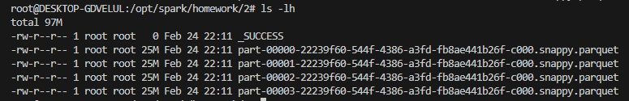

# Module 5 Homework

## Question 1: Install Spark and PySpark

1. Run PySpark
2. Create a local spark session
3. Execute spark.version.

What's the output?

```
'3.3.
```

## Question 2: Yellow October 2024

Read the October 2024 Yellow into a Spark Dataframe. Repartition the Dataframe to 4 partitions and save it to parquet.

What is the average size of the Parquet (ending with .parquet extension) Files that were created (in MB)? Select the answer which most closely matches.

```python

import pyspark
from pyspark.sql import SparkSession

spark = SparkSession.builder.master("local[*]").appName('test').getOrCreate()

df = spark.read.parquet('yellow_tripdata_2024-10.parquet')
df = df.repartition(4)
df.write.parquet('homework/2')

```

Result:

<br>



<br>